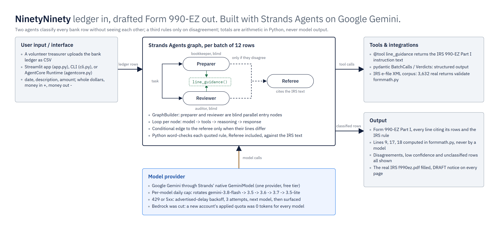

# NinetyNinety

**A shoebox of bank transactions becomes a drafted IRS Form 990-EZ, with every line citing the transactions behind it and the rule that put them there.**

Built with **Strands Agents** for the AWS *Agents for Humans* hackathon (Good Neighbor Agents track).

## The problem

The IRS processed **203,699 Form 990-EZ returns** in calendar year 2024, filed by 185,581 different organisations ([IRS SOI extract](https://www.irs.gov/statistics/soi-tax-stats-annual-extract-of-tax-exempt-organization-financial-data), one row per processed return). Every filer is small by definition: gross receipts under $200,000 and assets under $500,000. In the IRS e-file batch this project validates against, **1,106 of 3,687 returns carry no paid-preparer block** (30.0%), so nobody was paid to prepare them. Reproduce with `PYTHONPATH=src python scripts/preparers.py`.

Filing late costs $25 a day, capped at the lesser of $13,000 or 5% of gross receipts. Miss three years in a row and exemption is revoked automatically: contributions stop being deductible and the organisation must apply for exemption again ([Instructions for Form 990-EZ](https://www.irs.gov/instructions/i990ez), [auto-revocation FAQ](https://www.irs.gov/pub/irs-tege/auto_rev_faqs.pdf)). The [IRS Auto-Revocation List](https://apps.irs.gov/pub/epostcard/data-download-revocation.zip) downloaded on 2026-09-08 holds 1,247,210 revocations, 1,065,726 of them with no reinstatement date.

Existing filing tools start *after* the books are categorised. Categorising the books is the actual work, and it is the part nobody helps with.

## Who it is for

Volunteer treasurers of small US nonprofits: the little league, the food pantry, the community band. People with a bank export and no bookkeeper.

## Does the engine actually work?

Before drafting anything for a user, the same arithmetic that fills the form was run against **3,632 real Form 990-EZ returns** filed with the IRS (e-file XML batch `2026_TEOS_XML_01A`, 3,687 Form 990-EZ returns, of which 3,632 carried a Part I checkable for line 9), rebuilding each return's stated totals from its own line items:

| Part I identity | Reconstructed | Rate |
|---|---|---|
| Line 9, total revenue = lines 1 through 8 | **3,632 / 3,632** | **100.00%** |
| Line 17, total expenses = lines 10 through 16 | 3,617 / 3,618 | 99.97% |
| Line 18, excess = line 9 minus line 17 | 3,619 / 3,621 | 99.94% |

The three line mismatches sit in two real filed returns whose own stated totals disagree with their own components (one is off by one dollar). They are listed in `results/validation.json`. Reproduce with `PYTHONPATH=src python scripts/validate.py`.

## How it works



1. **Ledger in.** A CSV of `date, description, amount`. Raw bank text, no categories. Rows go through the graph in batches of twelve.
2. **One Strands Agents graph per batch.** The **Preparer** and the **Reviewer** are two entry nodes of a `GraphBuilder` graph. Strands hands each entry node only the rows, so the Reviewer never sees the Preparer's reasoning, and the two run in parallel. Both are instructed to call a real Strands tool, `line_guidance`, which returns the IRS instruction text for a Part I line, and both answer with structured output (pydantic). A **Referee** node hangs off a conditional edge and runs only when the two disagree on a row; it is instructed to call `line_guidance` on both candidate lines and returns a verdict with its reason. Every disagreement is shown with all three opinions and which line went on the form. Nothing is resolved silently.
3. **Python checks the model.** Every rule the Preparer, Reviewer or Referee quotes is checked against the IRS instruction sentence the tool returned: at least 60% of its words must appear in that sentence (the line's label does not count); a rule that fails is flagged as ungrounded. A Referee verdict is accepted only for one of the two disputed lines. Money flowing against a line (a refund) is netted, not added, and flagged. Lines 9, 17 and 18 are computed in `formmath.py`, the same module the validation harness runs over real filings. The model never adds.
4. **The real IRS PDF.** Amounts land in the actual `f990ez.pdf` AcroForm fields, and every page carries a red **DRAFT - NOT A FILING** notice.
5. **The trace is on screen.** Per batch: which nodes ran, in what order, how many model calls and tool calls each agent made (a Strands `HookProvider` on `BeforeToolCallEvent` and `AfterModelCallEvent`, shared by the three agents), whether the Referee was needed, and which provider answered.

## Run it

```bash
git clone https://github.com/ishal1410/ninetyninety
cd ninetyninety
pip install -r requirements.txt   # Python 3.10 or newer
cp .env.example .env    # then paste a free key from https://aistudio.google.com/apikey
PYTHONPATH=src python cli.py fixtures/demo_ledger.csv
```

Web UI: `streamlit run app.py`

Landing page: `index.html` (GitHub Pages, repo root). It shows the recorded demo run; refresh it after a run with `PYTHONPATH=src python scripts/dump_run.py && python scripts/build_landing.py`.

Tests: `python -m pytest` (158 tests; the one live end-to-end test runs only with `NN_LIVE=1` and a key)

## Model: Google Gemini

One provider: Google Gemini through Strands' native `GeminiModel` (`src/ninetyninety/config.py`). `GOOGLE_API_KEY` in `.env` is the only required setting (see `.env.example`); the free tier needs no card. Its daily cap is per model id (measured 2026-09-06: 20 requests a day per model per project), so `prepare_ledger` rotates through `GEMINI_MODEL_IDS` when one is exhausted. On a 429 or a 5xx the batch sleeps for the delay Gemini advertises and retries; after three attempts it moves to the next model id, and a batch no model can answer is recorded as unclassified with the error text while the run continues, so nothing already classified is lost.

Amazon Bedrock was the first choice and is a one-line swap (`BedrockModel` in place of `GeminiModel`). It is not used for the demo because a new AWS account's applied Bedrock quota is 0 tokens/day for every model and region until AWS Support seeds it, which did not happen before the deadline.

## Live demo

Product page for treasurers: **https://ishal1410.github.io/ninetyninety/**

How it is built, with the recorded run's trace: **https://ishal1410.github.io/ninetyninety/technical.html**

Hosted app: https://ninetyninety.streamlit.app (Streamlit Community Cloud, free tier; it sleeps after inactivity, so the first load can take a minute). Use "Replay the recorded run" if the day's free Gemini quota is spent. Or run it locally with `streamlit run app.py`.

## Troubleshooting

- **`ModuleNotFoundError: ninetyninety`**: run from the repo root with `PYTHONPATH=src` in front of every `python` command, including `python -m pytest`.
- **`GOOGLE_API_KEY` missing**: copy `.env.example` to `.env` and paste a free key from https://aistudio.google.com/apikey. No card is needed.
- **`429` or `RESOURCE_EXHAUSTED` in the trace**: the free tier allows a small number of requests per day per model id. The run rotates through `GEMINI_MODEL_IDS` on its own; if every id is spent, wait until midnight Pacific or add another id to `.env`.
- **A batch shows as unclassified**: no model answered it after three attempts. The rest of the run is kept. Re-run the ledger later and the batch will be filled.
- **CSV rejected**: the file needs `description` and `amount` columns (`date` is optional), header case does not matter. Amounts may be negative or in parentheses. Files saved by Excel on Windows (cp1252) are accepted.
- **Garbled characters in the Windows console**: the CLI already switches the console to a replacement encoding; if you still see them, run `chcp 65001` first.

## Limitations, stated plainly

- **The output is a draft, not a filing.** For tax year 2025 the IRS requires Form 990-EZ to be filed electronically, which needs an Authorized IRS e-File Provider. This project is not one.
- **An officer of the organisation must review and sign.** The Paid Preparer block is left blank on purpose.
- **Only Part I is drafted.** Parts II through VI and all Schedules are out of scope. The app does not pretend to fill them.
- **The demo ledger is synthetic.** `fixtures/demo_ledger.csv` is made up. The accuracy numbers above come from real IRS filings, never from that file.
- **Classification is a model judgement.** The two-agent design surfaces uncertainty; it does not eliminate it. Low-confidence and disputed rows are flagged for a human.

## Disclosure

Third-party inputs: the public IRS blank form `f990ez.pdf`, the public IRS Form 990 e-file XML corpus, and the Strands Agents SDK. All project code was written during the submission period. `results/validation.json` lists EINs and organisation names exactly as the IRS publishes them in the e-file corpus.

## Layout

```
src/ninetyninety/
  lines.py        Part I line taxonomy, IRS XML element names, guidance text
  formmath.py     the only place totals are computed
  ledger.py       CSV in -> Transaction rows with source-row provenance
  agents.py       the Strands graph: Preparer, Reviewer, Referee, line_guidance tool
  prepare.py      batch the ledger through the graph, back off on 429, fail over, assemble Part I
  pdffill.py      fill the real IRS AcroForm, stamp DRAFT on every page
  corpus/         IRS 990 e-file XML index, parser, validation harness
cli.py            terminal entry point
app.py            Streamlit UI
scripts/          validate.py (the headline number; downloads the IRS batch into data/ on first run and rewrites results/validation.json),
                  preparers.py (how many real 990-EZ filers paid a preparer), dump_run.py, build_landing.py, diagram.py, dump_fields.py
```

## License

MIT. See `LICENSE`.
